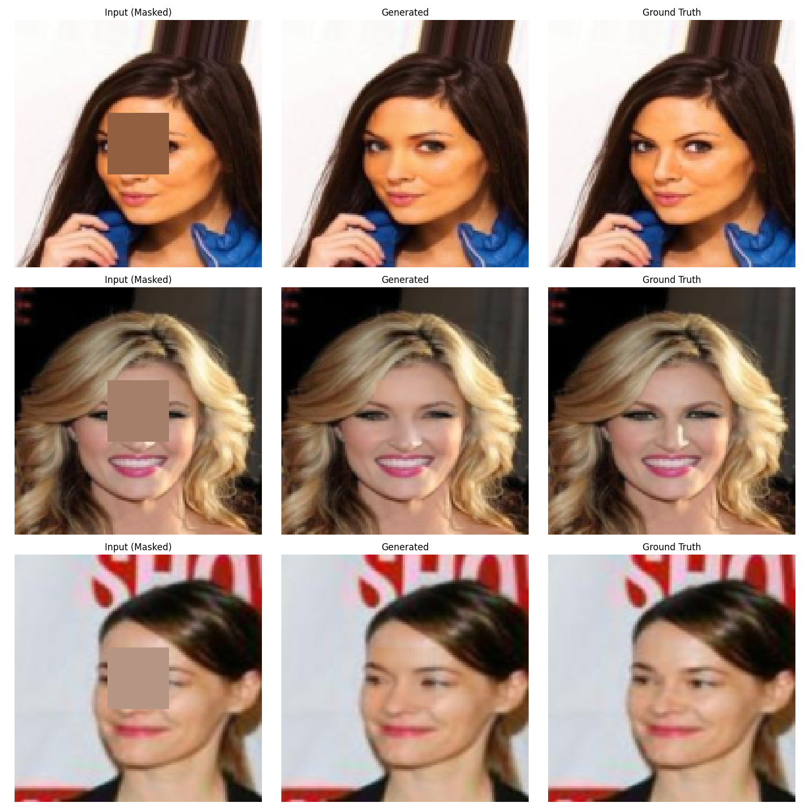

# Image Completion – Globally and Locally Consistent Image Completion (SIGGRAPH 2017)

[Official Paper & Project Page](https://iizuka.cs.tsukuba.ac.jp/projects/completion/en/)

本專案為 SIGGRAPH 2017 論文 **“Globally and Locally Consistent Image Completion”** 的非官方 PyTorch 實作，包含完整的訓練、推論、與 CelebA 資料前處理腳本。

---

## 專案背景與實作說明

本專案旨在實作 SIGGRAPH 2017 所提出之 **Globally and Locally Consistent Image Completion** 方法，並聚焦於人臉影像中心區域的補全。原論文針對任意遮罩位置進行影像填補，本實作則針對人臉正中心區域進行補全，以更聚焦於網路訓練穩定性與人臉結構完整性的探討。

### 模型架構

本模型由三個子網路組成：

* **補全網路（Completion Network）**：全卷積結構，具備 encoder-decoder 架構，並加入膨脹卷積以擴大感受野。
* **全域判別器（Global Context Discriminator）**：輸入整張圖像，評估補全後結果是否與整體場景一致。
* **區域判別器（Local Context Discriminator）**：聚焦於補全區域附近，強化局部細節真實性。

在訓練過程中，模型先單獨訓練生成器，使其具備初步的重建能力；接著訓練兩個判別器，強化其辨別真偽的能力；最後進行生成器與判別器的交錯訓練，透過對抗式學習進一步提升生成圖像的品質。

### 實作與修改重點

本專案使用 PyTorch 完成，並針對原論文架構進行幾項簡化與改良：

* **遮罩固定為臉部中心區域**：簡化訓練與驗證流程。
* **判別器結構調整**，將原本的全連接層修改為 label + Binary Cross Entropy 損失。
* **前處理流程**：使用周圍區域資訊對中心遮罩預填補，改善收斂表現。
* **超參數實驗**：嘗試不同的判別器層數與 λ 權重組合，以增進補全品質與訓練穩定性。

### 成果展示與觀察

| 左側      | 中央     | 右側             |
| --------- | -------- | --------------- |
| 輸入影像（中間區域遮蔽，需進行補全） | 模型補全後的輸出結果 | 原始完整影像(Ground Truth) |

實驗結果顯示，補全結果在視覺上一致性佳，細節過渡自然，儘管偶有輕微色偏但整體仍相當逼真。



---

## 目錄結構

```text
.
├── config.py            # 超參數與路徑設定
├── dataloader.py        # 自訂 Dataset 與 DataLoader
├── model.py             # 補全網路 + 全域 / 區域判別器
├── preprocess_celeba.py # CelebA 影像裁剪
├── train.py             # 訓練
├── test.py              # 推論 / 測試腳本
└── utils.py             # 影像與訓練流程輔助函式
```

---

## 快速開始

### 1 . 安裝依賴

```bash
# 建議使用 conda 或 venv 隔離環境
conda create -n glcic python=3.10.12 -y
conda activate glcic

# 建議對應 CUDA 12.6 安裝 PyTorch
pip install torch==2.0.1+cu126 torchvision==0.15.2+cu126 torchaudio==2.0.2 --index-url https://download.pytorch.org/whl/cu126

pip install -r requirements.txt
```

> **實測版本**：Python 3.10.12、PyTorch 2.0.1+cu126、CUDA 12.6

### 2 . 準備資料集（CelebA）

1. [從 ](https://mmlab.ie.cuhk.edu.hk/projects/CelebA.html)[CelebA 官網](https://mmlab.ie.cuhk.edu.hk/projects/CelebA.html) 下載原始影像。
2. 執行前處理腳本將影像進行裁剪 ：

   ```bash
   python3 preprocess_celeba.py
   ```

### 3 . 開始訓練

```bash
python3 train.py
```

### 4 . 推論 / 測試

```bash
python3 test.py --model_name G_best.pth
```

---

## 檔案說明

| 檔案                        | 功能概要                  |
| ------------------------- | --------------------- |
| **config.py**             | 集中管理超參數與路徑。           |
| **dataloader.py**         | 讀取影像，回傳至訓練。         |
| **model.py**              | 定義補全網路與兩個判別器。         |
| **preprocess\_celeba.py** | 將 CelebA 原圖裁剪、resize。 |
| **train.py**              | 訓練流程、loss 計算。         |
| **test.py**               | 影像補全與存檔。         |
| **utils.py**              | 通用工具（視覺化、checkpoint）。 |

---

## 引用 (Citation)

如果你的研究使用到本程式碼，請引用原始論文：

```bibtex
@Article{IizukaSIGGRAPH2017,
  author = {Satoshi Iizuka and Edgar Simo-Serra and Hiroshi Ishikawa},
  title = {{Globally and Locally Consistent Image Completion}},
  journal = "ACM Transactions on Graphics (Proc. of SIGGRAPH 2017)",
  year = 2017,
  volume = 36,
  number = 4,
  pages = 107:1--107:14,
  articleno = 107,
}
```

---

